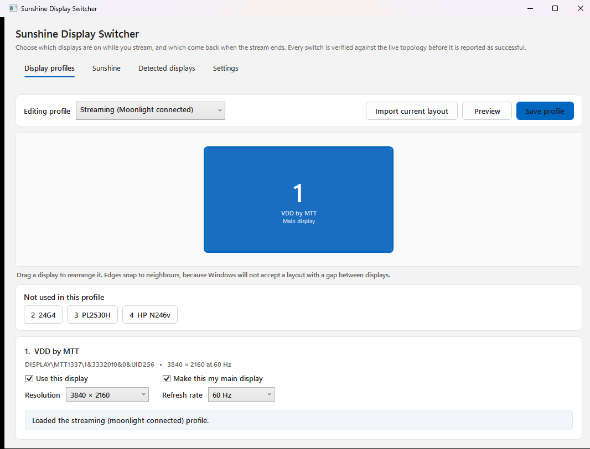
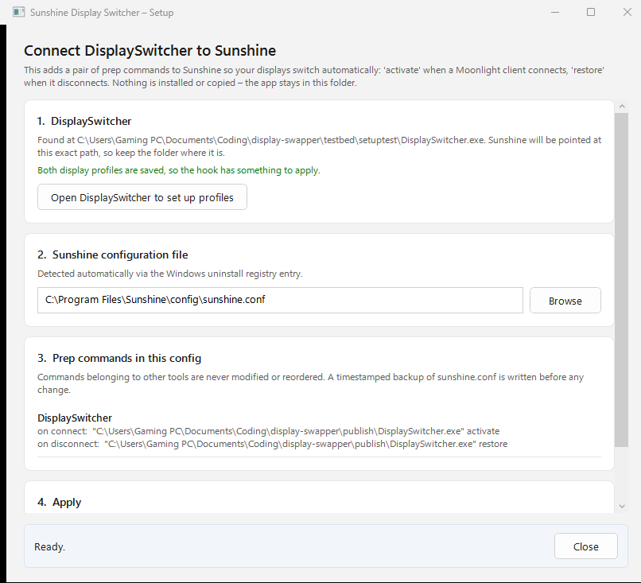
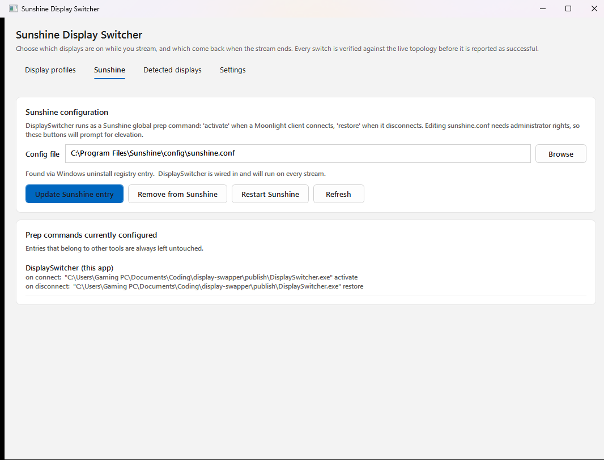
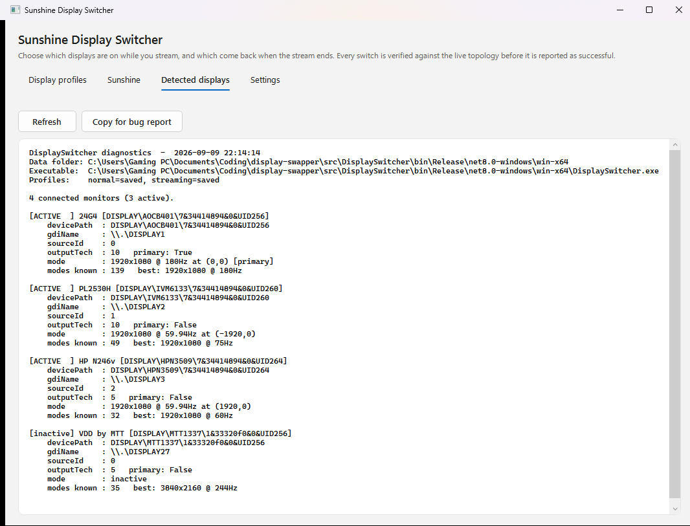
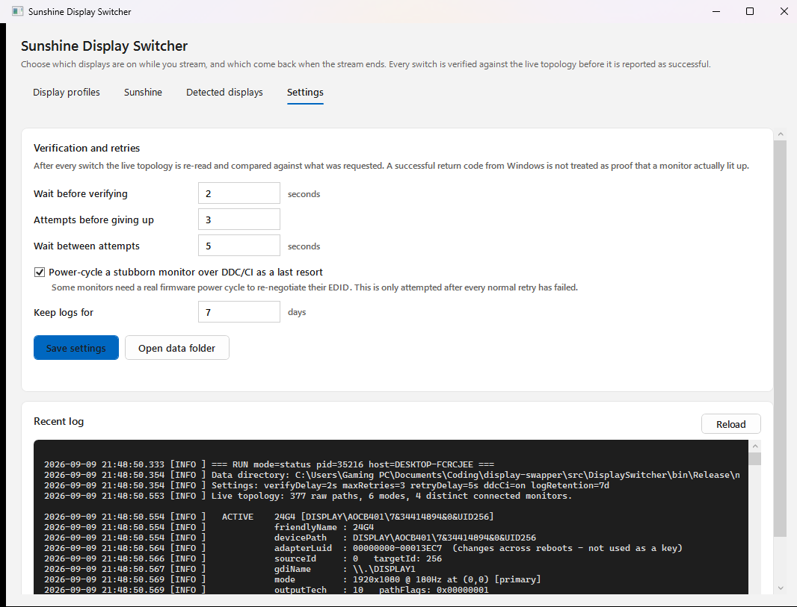

# Sunshine Display Switcher

Switches your monitors when a Moonlight client connects, switches them back when it disconnects, and **verifies that the switch actually happened** instead of trusting Windows' return code.

Built for [Sunshine](https://github.com/LizardByte/Sunshine) hosts, especially ones streaming to a virtual display so the physical monitors can stay off.

- **DisplaySwitcher.exe** — the app. Double-click it for the configuration window, or let Sunshine run it headlessly.
- **Setup.exe** — wires the app into Sunshine's prep commands, without disturbing any prep commands you already have.



---

## Why verification matters

Windows' `SetDisplayConfig` returns `ERROR_SUCCESS` when it has *accepted* your request, not when the monitors have finished obeying it. On the machine this was written for, that gap is reproducible: the call succeeds, the tool reports victory, and the display is still sitting at the wrong resolution — or dark.

So after every switch this tool waits, re-reads the live topology through `QueryDisplayConfig`, and compares it against what was asked for: which displays are on, their resolutions, their positions, and which one is primary. If reality disagrees it retries, and as a last resort power-cycles the offending monitor over DDC/CI (VCP code `0xD6`) to force an EDID re-handshake. Only a verified match exits with code 0.

The other half of the reliability story is identity. Monitors are keyed by their **PnP device instance path** (`DISPLAY\MTT1337\1&33320f0&0&UID256`), not by adapter LUID or GDI name like `\\.\DISPLAY3`. LUIDs are reassigned across reboots and driver reloads, and GDI numbering shuffles the moment a display is switched on or off — which is precisely when this tool runs.

---

## Quick start

1. Download the ZIP from [Releases](../../releases) and unzip it somewhere permanent, such as `C:\Tools\DisplaySwitcher`. Sunshine will be pointed at that exact path, so don't unzip to a temp folder.
2. Run **DisplaySwitcher.exe**. Arrange the displays you want *while streaming*, save that as the **Streaming** profile, then arrange your normal desktop and save it as the **Desktop** profile.
3. Run **Setup.exe** (it asks for administrator rights, because `sunshine.conf` lives under Program Files). Confirm the detected config file and press **Wire into Sunshine**, then let it restart Sunshine.
4. Connect from Moonlight. Your displays should switch, and switch back when you disconnect.



There is nothing to uninstall — delete the folder, and use Setup's **Remove from Sunshine** first to take the prep commands back out.

---

## The configuration window

**Display profiles** is where the work happens. Pick which profile you are editing, then arrange displays on the canvas exactly like the Windows display settings page: drag them around, and their edges snap to their neighbours. Snapping isn't cosmetic — Windows rejects a layout with a gap between displays, so this keeps your arrangement applicable.

Select a display to get its controls: **Use this display**, **Make this my main display**, and resolution/refresh dropdowns. Displays you turn off drop into an unused tray below the canvas.

Two buttons worth knowing:

- **Import current layout** replaces the profile with whatever is on screen right now. This is the fastest way to build a profile: arrange your monitors in Windows, then import.
- **Preview** applies the profile for real, through the same verify-and-retry path Sunshine uses. It is the only way to be sure a profile works before you rely on it mid-stream.

**Sunshine** shows every global prep command configured, marking which one is ours.



**Detected displays** dumps the raw topology with a *Copy for bug report* button, which is what to paste into an issue.



**Settings** exposes the retry timings and DDC/CI toggle, and tails the log.



### Resolutions for a display that is switched off

Configuring a virtual-display-only streaming profile means picking a resolution for a display that is currently dark. That works because the mode list comes from `EnumDisplaySettingsExW`, which happily enumerates modes for a display that is *attached but inactive* — on the reference machine, a switched-off virtual display still reported 35 modes topping out at 3840×2160 @ 244 Hz.

---

## Command line

`DisplaySwitcher.exe` is a Windows-subsystem binary so Sunshine doesn't flash a console window twice per stream, but it attaches to your terminal when you run it with arguments.

| Command | What it does |
| --- | --- |
| `DisplaySwitcher.exe` | Opens the configuration window |
| `DisplaySwitcher.exe activate` | Applies the streaming profile |
| `DisplaySwitcher.exe restore` | Applies the desktop profile |
| `DisplaySwitcher.exe apply <name>` | Applies any saved profile |
| `DisplaySwitcher.exe capture <name>` | Saves the current layout as `<name>.json` |
| `DisplaySwitcher.exe status` | Prints the live topology and device paths |
| `DisplaySwitcher.exe install-hook` | Wires into Sunshine (needs admin) |
| `DisplaySwitcher.exe remove-hook` | Removes it from Sunshine (needs admin) |

Exit codes: `0` verified success, `1` verification failed, `2` a required display is missing, `3` bad arguments or missing profile, `4` unexpected error.

One quirk: because it is a GUI-subsystem binary, PowerShell returns your prompt immediately instead of waiting. Use `Start-Process -Wait .\DisplaySwitcher.exe -ArgumentList status` if you want to block. Sunshine waits on the process handle either way, so the hook is unaffected.

---

## Files

Everything lives beside the executable, so the whole thing stays portable:

```
DisplaySwitcher.exe
Setup.exe
settings.json          verify delays, retry counts, DDC/CI toggle, log retention
normal.json            the desktop profile
streaming.json         the streaming profile
logs/displayswitcher.log
```

If that folder is not writable — you unzipped into Program Files, say — everything moves to `%ProgramData%\DisplaySwitcher` instead, and the log says which root won.

### settings.json

| Setting | Default | Meaning |
| --- | --- | --- |
| `verifyDelaySeconds` | 2 | How long to let the drivers settle before re-reading the topology |
| `maxRetries` | 3 | Attempts before giving up |
| `retryDelaySeconds` | 5 | Wait between attempts |
| `enableDdcCiEscalation` | true | Power-cycle a stubborn monitor over DDC/CI as a last resort |
| `ddcCiPowerCycleSeconds` | 3 | How long to hold the monitor in standby |
| `ddcCiSettleSeconds` | 5 | Wait after power-on before re-verifying |
| `logRetentionDays` | 7 | Log lines older than this are pruned at startup |

---

## How the Sunshine integration works

Sunshine's `global_prep_cmd` is a JSON array of `{do, undo, elevated}` objects. Setup adds one entry:

```json
{"do":"\"C:\\Tools\\DisplaySwitcher\\DisplaySwitcher.exe\" activate",
 "undo":"\"C:\\Tools\\DisplaySwitcher\\DisplaySwitcher.exe\" restore",
 "elevated":false}
```

Plenty of Sunshine users chain several prep commands, so **only entries that reference `DisplaySwitcher.exe` are ever touched**. Everything else is preserved in its original order, the array is edited as parsed JSON rather than regenerated, a timestamped `.bak` is written first, and only the `global_prep_cmd` line of the file is rewritten.

Sunshine reads its config only at startup, so restart it after any change.

---

## Troubleshooting

**The switch reports failure but my screens look fine.** Read `logs/displayswitcher.log` — it prints the requested state and the observed state side by side. A refresh-rate mismatch within 1 Hz is only a warning (59 Hz versus 59.94 Hz); anything else is a real disagreement.

**A monitor stays black after switching back.** Turn on DDC/CI escalation in Settings. Some monitors need a real firmware power cycle to re-negotiate their EDID, and the driver alone can't force one. Note that not every monitor implements VCP `0xD6`.

**"A display this profile needs is not connected right now" (exit code 2).** A display the profile expects to be *on* is unplugged or powered off. A display the profile expects to be *off* being absent is fine — it is logged as a warning and dropped, which is what makes undocking a laptop or leaving a TV unplugged harmless.

**Nothing happens when I stream.** Check Setup shows the hook installed, that you restarted Sunshine afterwards, and that the folder hasn't moved since — the prep command holds an absolute path. `logs/displayswitcher.log` gets an entry for every run, including ones Sunshine triggers, so an empty log means Sunshine never called it.

**My layout won't save.** Windows requires the desktop to be one connected area with exactly one main display. The status bar names the specific problem; drag the stranded display until it snaps to a neighbour.

---

## Building from source

Needs the .NET 8 SDK.

```powershell
dotnet build DisplaySwitcher.sln -c Release
./scripts/publish.ps1 -Version 1.0.0    # produces dist/DisplaySwitcher-v1.0.0-win-x64.zip
```

The solution is three projects: `DisplaySwitcher.Core` holds all the logic and native interop with no UI, and the two WPF executables sit on top of it.

## License

[MIT](LICENSE).
